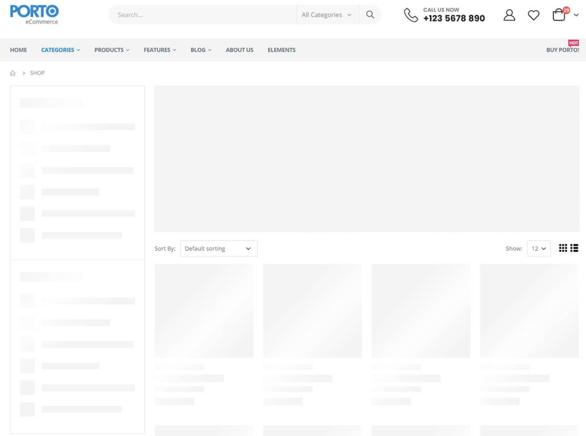
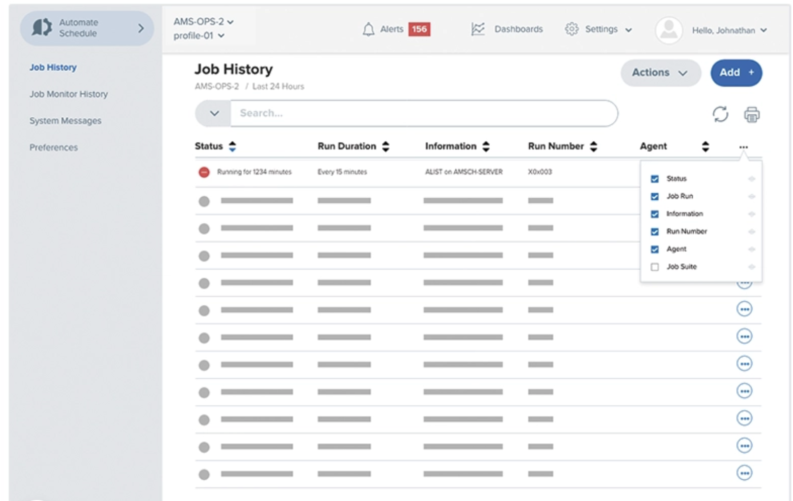

# Frontend challenge

## Jamii

### Stack general

-   Laravel 9.x
-   Inertiajs
-   React
-   [Mantine](https://mantine.dev)
-   PHP >8.0
-   node >16.0

### Descripción general

Este repo esta compuesto de un proyecto de Laravel vacío con un cascarón de la librería de UI Mantine.

El frontend web de Jamii esta diseñado para ser usado por:

-   Agencias
-   Personas a cargo de marketing de una empresa
-   Recursos humanos
-   Personas con un **pequeño** background técnico

En general, replicamos funcionalidad e interfaces tradicionales para disminuir la curva de aprendizaje (ejemplos debajo)

### Consideraciones

-   Utilizamos principalmente 3 componentes:
    -   Tablas
    -   Wizards
    -   Modales
-   En Jamii apreciamos la usabilidad sobre procesos.

> Individuals and interactions **_over processes_**
>  **_and tools_**

-   Usamos React para toda interacción con frontend
-   Usamos solamente componentes **funcionales**

### Tasks

-   Clona este repo a tu ambiente local
-   Crea una nueva rama **[TUNOMBRE]**
-   Crea una nueva página (folder/index.js) llamada “`UserList`” dentro de la carpeta `resources/js/Pages`
    -   El backend está preparado para regresar una lista de usuarios usando el hook `usePage()` puedes leer más sobre esta funcionalidad [aquí](https://inertiajs.com/shared-data#accessing-shared-data)
    -   Puedes revisar las rutas en web.php y los métodos correspondientes en `Controller.php`
-   La página está asociada a la ruta `/challenge`.
-   Usando los componentes de la librería Mantine, desarrolla una forma interesante de mostrar la información importante de los usuarios.
-   Toda la información es dummy, puedes agregar botones y/o acciones que simulen alguna interacción (eliminar, crear, etc.).
-   No es necesario desarrollar un layout complicado, estamos buscando reconocer el ingenio para mostrar información **Raw** de una forma interesante.

### Testing & finishing up

-   Para probar tu código puedes utilizar alguna de las siguientes opciones:
    -   Laravel cuenta con un comando para probar tu servidor de forma local: `php artisan serve`
    -   Puedes utilizar Laravel valet si así lo deseas, más información [aquí](https://laravel.com/docs/9.x/valet)
-   Para ver tus cambios reflejados deberás correr el comando `npm run dev` o `npm run watch` para escuchar cambios en tu código en vivo.
-   Una vez que termines, deberás correr el comando `npm run prod` y hacer un push a tu rama.
-   Crea un pull request contra la rama master y notifica a tu contacto en Jamii que has terminado.
